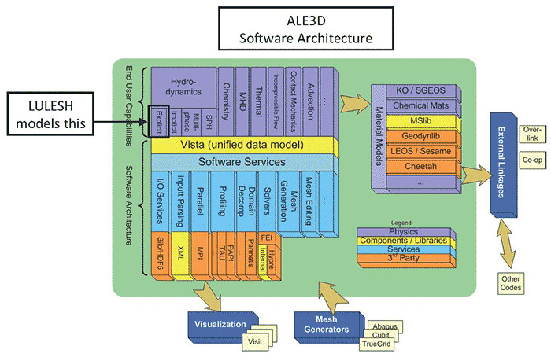

LULESH-Accelerate
=================

Implementation of the Livermore Unstructured Lagrangian Explicit Shock
Hydrodynamics (LULESH) mini-app using [Accelerate][accelerate].

[LULESH][lulesh] represents a typical hydrodynamics code such as [ALE3D][ale3d],
but is a highly simplified application, hard-coded to solve the Sedov blast
problem on an unstructured hexahedron mesh.

Benchmarks
----------

Macbook Pro 10,1 (Mid 2012)

  - Intel Core i7-3720QM CPU @ 2.60GHz
  - NVIDIA GeForce GT 650M GPU @ 900MHz
  - macOS 10.11.6
  - 30 x 30 x 30 grid
  - 8 threads

| Implementation | Compiler | Time (s) | SLOC |
-----------------|----------|---------:|-----:|
| [LULESH-OMP.cc](reference/C/LULESH-OMP.cc) | Clang 3.9.0 | 16.7 | 2400 |
| [LULESH-OMP.cc](reference/C/LULESH-OMP.cc) | ICC 16.0.4 | 16.6 | 2400 |
| [CUDA](reference/CUDA/lulesh-kepler-singlegpu) | CUDA 8.0.46 | 8.82 | 3000 |
| [accelerate-llvm-native](https://github.com/AccelerateHS/accelerate-llvm) | GHC 7.10.3, LLVM 3.9 | 9.30 | 1200 |
| [accelerate-llvm-ptx](https://github.com/AccelerateHS/accelerate-llvm) | GHC 7.10.3, LLVM 3.9 (NVPTX) | 10.35 | 1200 |
| [accelerate-llvm-ptx](https://github.com/AccelerateHS/accelerate-llvm) (-fnvvm) | GHC 7.10.3, LLVM 3.8 (NVVM) | 9.82 | 1200 |

  [accelerate]:         https://github.com/AccelerateHS/accelerate
  [ale3d]:              https://wci.llnl.gov/simulation/computer-codes/ale3d
  [lulesh]:             https://codesign.llnl.gov/lulesh.php

