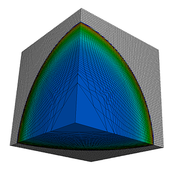

Accelerate-LULESH
=================

Implementation of the Livermore Unstructured Lagrangian Explicit Shock
Hydrodynamics (LULESH) mini-app using [Accelerate][accelerate].

[LELESH][lulesh] represents a typical hydrodynamics code such as [ALE3D][ale3d],
but is a highly simplified application, hard-coded to solve the Sedov blast
problem on an unstructured hexahedron mesh.

  [accelerate]:         https://github.com/AccelerateHS/accelerate
  [ale3d]:              https://wci.llnl.gov/simulation/computer-codes/ale3d
  [lulesh]:             https://codesign.llnl.gov/lulesh.php

